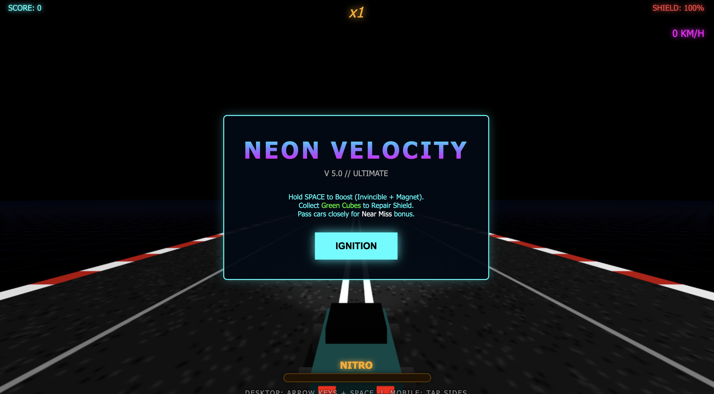
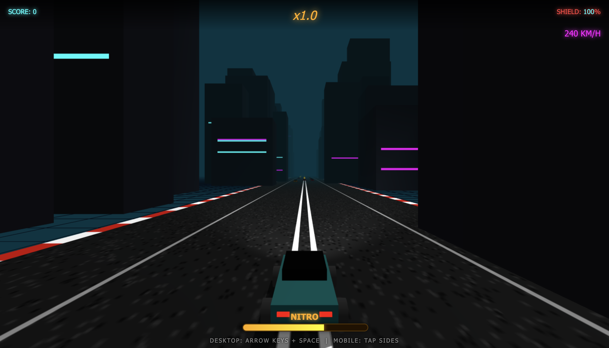
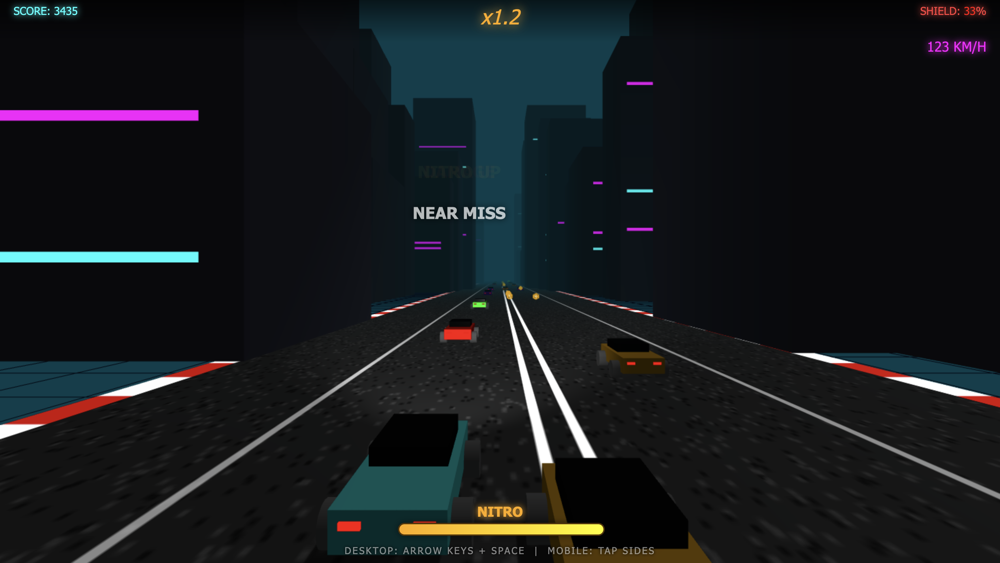

# 🚗💨 Neon Velocity 3D: Ultimate

<div align="center">



**A high-octane 3D racing game built with Three.js**

[🎮 Play Now](https://bhanu2006-24.github.io/neon-velocity/) | [Report Bug](https://github.com/bhanu2006-24/neon-velocity/issues) | [Request Feature](https://github.com/bhanu2006-24/neon-velocity/issues)

</div>

---

## 🌟 About

**Neon Velocity** is an adrenaline-pumping 3D racing game where you navigate through neon-lit highways at blazing speeds. Dodge traffic, collect power-ups, and push your skills to the limit in this cyberpunk-inspired endless runner.

## ✨ Features

- 🎨 **Stunning Neon Aesthetics** - Immersive cyberpunk visuals with dynamic lighting
- 🚀 **Nitro Boost System** - Activate invincibility and magnet mode
- 🏆 **Score Multipliers** - Perform near misses for bonus points
- 🛠️ **Repair Kits** - Collect green cubes to restore your shield
- 🌓 **Dynamic Day/Night Cycle** - Experience changing atmospheres
- 📱 **Mobile Friendly** - Play on desktop or mobile devices
- 🎮 **Smooth 3D Graphics** - Powered by Three.js

## 🎮 How to Play

### Desktop Controls
- **Arrow Keys** - Steer left/right
- **Space Bar** - Activate Nitro Boost

### Mobile Controls
- **Tap Left/Right** - Steer your vehicle

### Gameplay Tips
- Hold **SPACE** to boost (grants invincibility + magnet effect)
- Collect **Green Cubes** to repair your shield
- Pass cars closely for **Near Miss** bonuses
- Maintain your multiplier by avoiding crashes

## 🖼️ Screenshots

<div align="center">


*High-speed action on the neon highway*


*Nitro boost mode activated*

</div>

## 🚀 Quick Start

1. Clone the repository:
```bash
git clone https://github.com/bhanu2006-24/neon-velocity.git
```

2. Navigate to the project directory:
```bash
cd neon-velocity
```

3. Open `index.html` in your browser or use a local server:
```bash
# Using Python
python -m http.server 8000

# Using Node.js
npx serve
```

4. Visit `http://localhost:8000` and start playing!

## 🛠️ Built With

- [Three.js](https://threejs.org/) - 3D graphics library
- HTML5 Canvas
- Vanilla JavaScript
- CSS3

## 🎯 Game Mechanics

- **Health System** - Start with 3 shield points
- **Nitro System** - Rechargeable boost meter (starts at 50%)
- **Score Multiplier** - Builds up to 10x with skillful driving
- **Near Miss Bonus** - 200 points × multiplier
- **Smash Bonus** - 500 points × multiplier (during nitro)
- **Repair Kits** - Restores 1 shield point

## 📦 Project Structure

```
neon-velocity/
├── index.html          # Main game file
├── public/            # Assets
│   ├── img1.png
│   ├── img2.png
│   └── img3.png
├── README.md
├── LICENSE
└── .gitignore
```

## 🤝 Contributing

Contributions are welcome! Feel free to:

1. Fork the project
2. Create your feature branch (`git checkout -b feature/AmazingFeature`)
3. Commit your changes (`git commit -m 'Add some AmazingFeature'`)
4. Push to the branch (`git push origin feature/AmazingFeature`)
5. Open a Pull Request

## 📄 License

This project is licensed under the MIT License - see the [LICENSE](LICENSE) file for details.

## 🎮 Play Online

**Live Demo**: [https://bhanu2006-24.github.io/neon-velocity/](https://bhanu2006-24.github.io/neon-velocity/)

## 👨‍💻 Developer

**Bhanu Pratap Saini**

---

<div align="center">

**Made with ❤️ and Three.js**

⭐ Star this repo if you enjoyed the game!

</div>
